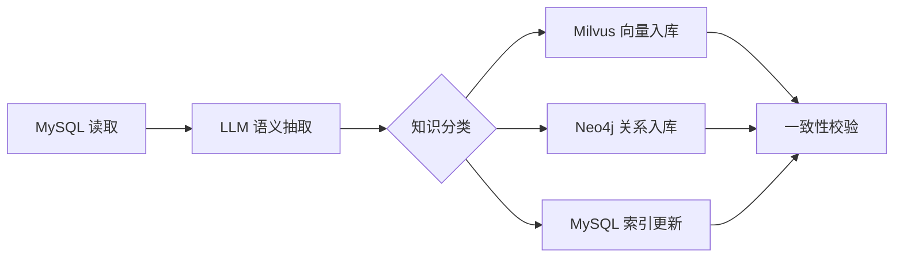

# 电商商品数据打标流程规范（知识构建）

## 文档概述 (Overview)

本规范定义了电商商品数据（业务类型_1）从清洗后的结构化数据到**知识提取 (Knowledge Extraction)**、**标签构建 (Tagging)**、**向量生成 (Embedding)** 和 **图数据存储 (Graph Storage)** 的完整细节。打标服务是构建“知识中枢”的关键环节。

**核心原则 (Core Principles)**：
- **职责分离**：打标阶段专门负责语义理解 (LLM Analysis)，不重复执行基础清洗。
- **全域关联**：通过 `knowledge_id (全局知识ID)` 统合三库存储。
- **双向验证**：提取的实体关系需与 MySQL 原始数据进行一致性比对。

---

## 第一部分：打标任务流程 (Task Workflow)

### 1.1 打标业务流 (Workflow)



**阶段说明**：
1.  **第一阶段：语义理解 (LLM Analysis)**：利用大模型对标题和描述进行多维度分析。
2.  **第二阶段：特征编码 (Embedding)**：将非结构化特征转化为向量。
3.  **第三阶段：拓扑构建 (Graph Construction)**：建立实体间的逻辑连接。
4.  **第四阶段：枢纽更新 (Knowledge Index Update)**：更新 `knowledge_index` 确保关联。

---

## 第二部分：实体识别与标签提取 (Entity Recognition & Tagging)

### 2.1 实体类型定义 (Entity Definitions)

**7类核心实体 (7 Core Entities)**：

| 实体类型 | 英文名 (English) | 中文备注 (Chinese Remarks) | 来源 (Source) | 用途 (Purpose) |
| :--- | :--- | :--- | :--- | :--- |
| **品牌实体** | `Brand` | 生产厂商或品牌名称 | 标题/品牌库 | 品牌聚合、竞品分析 |
| **型号实体** | `Model` | 具体的产品型号/系列 | 大模型识别 | 精准匹配、版本追踪 |
| **规格实体** | `Specification` | 硬件参数（内存/屏幕等） | `spec_params` | 性能对比、参数检索 |
| **功能实体** | `Feature` | 核心卖点或技术特征 | 大模型提取 | 场景搜索、需求匹配 |
| **分类实体** | `Category` | 行业标准分类或类目 | 大模型分类 | 目录导航、类目对标 |
| **价格实体** | `PriceTier` | 消费档位（高端/中端/入门）| 价格计算 | 消费画像、定价参考 |
| **质量实体** | `QualityTier` | 数据质量与口碑评价分级 | 评分/评论数 | 优质推荐、排序权重 |

### 2.2 标签提取规则 (Tagging Rules)

#### 规则 1：品牌与型号提取 (Brand & Model Extraction)
- **输入**: 商品标题 (`title`)。
- **逻辑**: 通过 LLM 识别“Apple”、“iPhone 16 Pro Max”等关键实体。
- **备注**: 需处理别名（如“华为”与“HUAWEI”归一化）。

| 原始标题 (Original Title) | 提取品牌 (Brand) | 提取型号 (Model) |
| :--- | :--- | :--- |
| 【官方旗舰店】Apple iPhone 16 Pro Max 256GB | Apple | iPhone 16 Pro Max |
| 三星Galaxy S24 Ultra 512GB 官方正品 | Samsung | Galaxy S24 Ultra |

#### 规则 2：规格参数结构化 (Specification Structuring)
- **输入**: `spec_params` JSON。
- **逻辑**: 提取标准化分类（`Screen`, `CPU`, `Battery` 等）。

#### 规则 3：价格与质量自动分级 (Tiering Rules)
- **价格分级**: 
  - `high_end` (高端): > 品类均值 150%
  - `mid_range` (中端): 品类均值 80%-150%
  - `budget` (低端): < 品类均值 80%
- **质量分级**: 
  - `excellent` (优秀): 评分 > 4.8 且评论 > 1000
  - `good` (良好): 评分 4.5-4.7
  - `average` (一般): 评分 3.0-4.4

---

## 第三部分：关系提取与图谱构建 (Relationship & Graph)

### 3.1 核心关系定义 (Core Relationships)

**7类核心关系 (7 Core Relationships)**：

| 关系名 (Relationship) | 源节点 (Source) | 目标节点 (Target) | 中文说明 (Description) | 方向 (Direction) |
| :--- | :--- | :--- | :--- | :--- |
| `HAS_BRAND` | `Product` | `Brand` | 商品属于某品牌 | 单向 (→) |
| `BELONGS_TO` | `Product` | `Category` | 商品属于某分类 | 单向 (→) |
| `HAS_SPEC` | `Product` | `Spec` | 商品具备某规格 | 单向 (→) |
| `SELLS_IN` | `Product` | `Shop` | 商品在某店铺销售 | 单向 (→) |
| `COMPETES_WITH` | `Product` | `Product` | 商品间为竞品关系 | 双向 (↔) |
| `SAME_SERIES` | `Product` | `Product` | 同一型号的不同配置 | 双向 (↔) |
| `UPGRADE_OF` | `Product` | `Product` | 迭代升级产品 | 单向 (→) |

---

## 第四部分：向量生成与语义编码 (Vector & Embedding)

### 4.1 向量生成策略 (Embedding Strategy)

**向量拼接顺序 (Embedding Sequence)**:
为了保证语义检索的稳定性，向量输入字符串必须按以下规则拼接：
`[标题] + [SEP] + [品牌] + [SEP] + [分类] + [SEP] + [核心规格] + [SEP] + [价格分级]`

**参数配置**:
- **模型 (Model)**: `text-embedding-3-small` (OpenAI) 或 `bge-large-zh-v1.5`。
- **维度 (Dimension)**: **768 维**。
- **索引算法 (Index)**: HNSW (Hierarchical Navigable Small World).

---

## 第五部分：知识索引统一管理 (Knowledge Indexing)

所有三库（MySQL, Milvus, Neo4j）的操作必须通过 `knowledge_id` 进行原子化关联：

| 系统 (System) | 存储路径 (Location) | 关联字段 (Key) |
| :--- | :--- | :--- |
| **MySQL** | `ec_product_info` 表 | `knowledge_id` (Primary Key) |
| **Milvus** | `EC_Vectors` 集合 | `knowledge_id` (ID Field) |
| **Neo4j** | `Product` 节点属性 | `k_id` (Property) |

---

## 第六部分：Milvus向量存储结构 (Milvus Storage)

### 6.1 Milvus Collection设计 (Collection Schema)

```
# Milvus Collection定义
fields = [
    FieldSchema(name="id", dtype=DataType.INT64, is_primary=True),
    FieldSchema(name="product_id", dtype=DataType.VARCHAR, max_length=100),
    FieldSchema(name="goods_id", dtype=DataType.INT64),
    FieldSchema(name="embedding", dtype=DataType.FLOAT_VECTOR, dim=768),
    FieldSchema(name="brand", dtype=DataType.VARCHAR, max_length=100),
    FieldSchema(name="price_tier", dtype=DataType.VARCHAR, max_length=50),
    FieldSchema(name="quality_tier", dtype=DataType.VARCHAR, max_length=50),
    FieldSchema(name="category", dtype=DataType.VARCHAR, max_length=100),
    FieldSchema(name="timestamp", dtype=DataType.INT64),
]
```

**Collection字段说明**：

| 字段名 | 数据类型 | 说明 |
|-------|---------|------|
| id | INT64 | 自增主键 |
| product_id | VARCHAR | 平台商品ID |
| goods_id | INT64 | 数据库内部ID |
| embedding | FLOAT_VECTOR | **核心字段**，商品语义向量 |
| brand | VARCHAR | 品牌，用于过滤检索 |
| price_tier | VARCHAR | 价格等级，用于过滤检索 |
| quality_tier | VARCHAR | 质量等级，用于过滤检索 |
| category | VARCHAR | 商品分类，用于过滤检索 |
| timestamp | INT64 | 向量生成时间戳 |

### 6.2 向量检索（语义搜索）

**示例：用户查询"高端5G手机"**：

```
用户查询：高端的5G手机，续航能力强
   ↓
1. 将查询转为向量
   ↓
2. 在Milvus中进行语义相似度检索
   ↓
3. 返回与查询语义相似的10个商品
```

---

## 第七部分：Neo4j图数据库存储结构 (Neo4j Storage)

### 7.1 Neo4j图节点设计 (Node Schema)

**5类核心节点**：

```
商品节点：
  product_id, goods_id, title, price, brand, rating, 
  price_tier, quality_tier, created_at

品牌节点：
  name, country, category, products_count

分类节点：
  name, parent_category, level

规格节点：
  type, value, unit, category

功能节点：
  name, category, description
```

### 7.2 Neo4j图关系设计 (Relationship Schema)

**7类核心关系**：

| 关系名 | 源节点 | 目标节点 | 说明 |
|-------|-------|--------|------|
| MANUFACTURES | Brand | Product | 品牌制造商品 |
| BELONGS_TO | Product | Category | 商品属于分类 |
| HAS_SPECIFICATION | Product | Specification | 商品有规格 |
| HAS_FEATURE | Product | Feature | 商品有功能 |
| PRICE_COMPARABLE | Product | Product | 商品价格可对标 |
| COMPETES_WITH | Brand | Brand | 品牌竞争 |
| SUBCATEGORY_OF | Category | Category | 分类层级 |

### 7.3 图查询示例

**查询1：获取品牌Apple的所有商品及其规格**

``cypher
MATCH (b:Brand {name: "Apple"})
-[r1:MANUFACTURES]->(p:Product)
-[r2:HAS_SPECIFICATION]->(s:Specification)
RETURN p.product_id, p.title, p.price, s.type, s.value
```

**查询2：推荐与iPhone 16相似的竞品**

``cypher
MATCH (p1:Product {product_id: "jd_123456789"})
-[r1:BELONGS_TO]->(c:Category)
<-[r2:BELONGS_TO]-(p2:Product)
WHERE p1.price_tier = p2.price_tier
RETURN p2.product_id, p2.title, p2.brand
ORDER BY ABS(p1.price - p2.price)
```

---

## 第八部分：知识索引统一管理

### 8.1 knowledge_index表设计

**表用途**：统一关联MySQL、Milvus、Neo4j三个存储系统

```
CREATE TABLE `knowledge_index` (
  `knowledge_id` BIGINT AUTO_INCREMENT PRIMARY KEY COMMENT '知识ID',
  
  `goods_id` BIGINT NOT NULL UNIQUE COMMENT '商品ID',
  `product_id` VARCHAR(100) NOT NULL UNIQUE COMMENT '平台商品ID',
  
  `milvus_id` BIGINT COMMENT 'Milvus Collection中的ID',
  `milvus_collection` VARCHAR(100) COMMENT 'Milvus Collection名称',
  `embedding_dimension` INT COMMENT '向量维度',
  `embedding_model` VARCHAR(100) COMMENT '向量模型名称',
  
  `neo4j_product_node_id` VARCHAR(100) COMMENT 'Neo4j Product节点ID',
  `neo4j_brand_node_id` VARCHAR(100) COMMENT 'Neo4j Brand节点ID',
  `neo4j_category_node_id` VARCHAR(100) COMMENT 'Neo4j Category节点ID',
  `neo4j_relation_count` INT COMMENT 'Neo4j中该节点的关系总数',
  
  `extraction_status` VARCHAR(50) COMMENT '知识提取状态',
  `extraction_score` DECIMAL(5, 2) COMMENT '知识提取质量评分',
  `entity_extraction_count` INT COMMENT '提取的实体数量',
  `relation_extraction_count` INT COMMENT '提取的关系数量',
  
  `knowledge_created_time` DATETIME NOT NULL COMMENT '知识生成时间',
  `knowledge_updated_time` DATETIME COMMENT '知识更新时间',
  
  `sync_status` VARCHAR(50) COMMENT '三库同步状态',
  `consistency_score` DECIMAL(5, 2) COMMENT '三库数据一致性评分',
  
  KEY `idx_goods_id` (`goods_id`),
  KEY `idx_product_id` (`product_id`),
  KEY `idx_milvus_id` (`milvus_id`),
  
  CHARSET=utf8mb4 COLLATE=utf8mb4_unicode_ci,
  ENGINE=InnoDB
) COMMENT='知识索引表（统一MySQL、Milvus、Neo4j三库）';
```

---

## 第九部分：打标流程的规模处理策略

### 9.1 数据规模分类处理

根据待处理数据规模采用不同的处理策略：

| 规模级别 | 数据量 | 处理方式 | 大模型调用 | 存储策略 |
|---------|-------|--------|----------|---------|
| 小规模 | <10万 | 全量处理 | 同步调用 | 一次性入库 |
| 中规模 | 10-100万 | 分批处理 | 异步调用+队列 | 批次顺序入库 |
| 大规模 | 100-1000万 | 分片处理 | 异步调用+并发队列 | 分片并行入库 |
| 超大规模 | >1000万 | 增量处理 | 分布式队列 | 增量同步入库 |

---

## 第十部分：常见问题与故障恢复

### 10.1 常见异常处理

| 异常类型 | 原因 | 处理方案 |
|---------|------|--------|
| 大模型API超时 | 并发量过高 | 使用指数退避重试、降低并发度 |
| Embedding生成失败 | 文本过长或模型异常 | 截断文本、使用备用模型 |
| Milvus写入失败 | 向量维度不匹配 | 验证维度、重连Milvus |
| Neo4j节点冲突 | 节点ID重复 | 使用MERGE而非CREATE |
| MySQL同步失败 | 唯一约束冲突 | 使用ON DUPLICATE KEY UPDATE |
| 三库数据不一致 | 部分操作失败 | 触发一致性修复流程 |

---

## 第十一部分：验收标准与交付清单

### 11.1 功能验收清单

- [ ] 实体识别准确率≥95%（抽样检查50条）
- [ ] 关系提取准确率≥92%（抽样检查50条）
- [ ] 向量生成成功率≥98%
- [ ] Milvus Collection中记录数与input一致
- [ ] Neo4j中节点和关系数量符合预期
- [ ] knowledge_index表完整关联三库
- [ ] 语义搜索功能正常
- [ ] 图数据库查询功能正常

### 11.2 性能验收标准

| 指标 | 标准值 | 测试场景 |
|-----|-------|---------|
| 单记录提取时间 | <30秒 | 100个样本平均 |
| 向量生成速度 | >100条/分钟 | 1000条批次 |
| Milvus检索延迟 | <100ms | 检索10个相似商品 |
| Neo4j图查询延迟 | <200ms | 查询竞品商品 |

---

**文档版本**：1.0  
**最后更新**：2024年1月  
**维护人员**：知识构建团队
